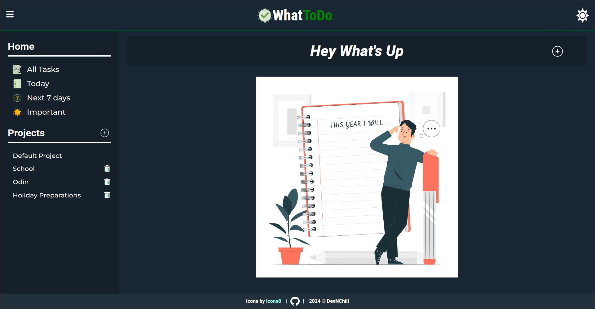
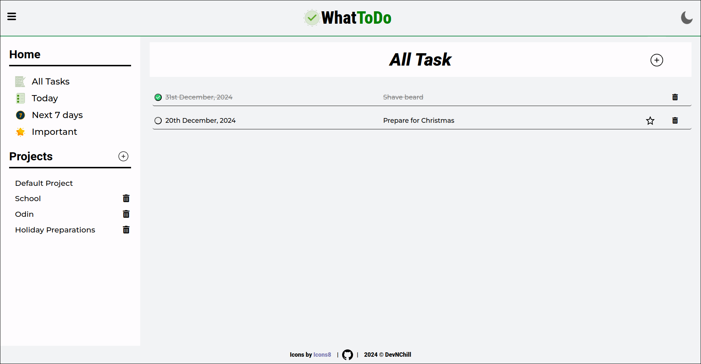

# To-Do Application

- [Preview](https://devnchill.github.io/todo)

This To-Do application was built to practice the **Single Responsibility Principle (SRP)** and **SOLID** principles for the first time. It offers two themes: **dark** and **light**, and uses **localStorage** to persist todos, projects, and theme choices.

## Features

- **Create, Edit, Delete Todos**: Users can manage their tasks with the ability to create, edit, delete, mark as complete, and mark as important.
- **Theme Selection**: Choose between a dark and light theme to personalize the interface.
- **Persistent Data**: Thanks to `localStorage`, all user preferences, including todos and theme choices, persist even after a page refresh.
- **Webpack Integration**: The project is bundled using Webpack to ensure efficient resource management.

## Icons

Icon by [ColourByteDesigns](https://freeicons.io/team-management-icon-set-22/task-bartask-checklist-menu-to-do-list-icon-icon-790381) on [freeicons.io](https://freeicons.io)  
Icon by [Pexelpy](https://freeicons.io/succes-icon-set-32645/list-todo-checklist-clipboard-inventory-task-icon-1240796) on [freeicons.io](https://freeicons.io)  
Icon by [Ahmad Smadi](https://freeicons.io/numbers-2/number-7-icon-699933) on [freeicons.io](https://freeicons.io)  
Icon by [Pexelpy](https://freeicons.io/ethics-icon-set-31168/approved-completed-done-guaranted-satisfaction-seal-icon-icon-1125324) on [freeicons.io](https://freeicons.io)  
Icon by [Oscar EstMont](https://freeicons.io/weather-2/icon-sun-lineal-color-icon-28915) on [freeicons.io](https://freeicons.io)  
Icon by [Fasil](https://freeicons.io/ios-edge-glyph/moon-icon-29411) on [freeicons.io](https://freeicons.io)  
Icon by [icon king1](https://freeicons.io/vector-and-svg-logos-icons-09/github-icon-icon-icon) on [freeicons.io](https://freeicons.io)  
Icon by [Raj Dev](https://freeicons.io/business-and-online-icons/sidebar-icon-icon) on [freeicons.io](https://freeicons.io)

## ShowCase

